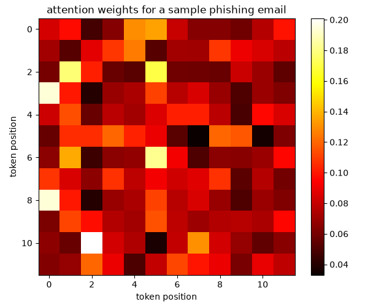

# PhishNet AI

A small attention-based neural network that learns to tell phishing emails apart from normal ones.

## Overview

Phishing emails tend to follow a handful of recognizable patterns: urgency, a brand name, a suspicious link, a call to "verify" or "pay now." This project explores whether a lightweight neural network can pick up on those patterns using an attention mechanism, and whether the resulting attention weights are interpretable enough to show which token positions the model is focusing on.

The dataset here is synthetic: a set of phishing-style templates and a set of normal, everyday email templates, each filled in with random variations (brand names, links, course names, dates, and so on). It is meant as a controlled sandbox for experimenting with the model and its attention behavior, not a production-grade classifier trained on real mail.

## Method

Each email is lowercased, stripped of punctuation, and split into tokens. The first 10 tokens are mapped to indices from a small vocabulary (padding with zero where an email has fewer tokens).

The model itself is intentionally simple:

- an embedding layer that turns token indices into 16-dimensional vectors
- a multi-head attention layer (4 heads) applied over the token embeddings, so the model can weigh tokens against each other
- mean-pooling over the attended sequence, followed by a single linear layer and a sigmoid, producing a phishing/normal probability

It is trained with the Adam optimizer and binary cross-entropy loss for 10 epochs. This is a feedforward network with an attention block bolted on for interpretability, not a full transformer encoder, and the dataset is small and synthetic, so treat it as a demonstration of the technique rather than a benchmark result.

## Results

After training, the attention weights for a sample email are extracted and rendered as a heatmap showing how much each token position attends to every other position:



Brighter cells indicate stronger attention between the corresponding token positions. Even with a handful of training epochs, the pattern is not uniform, some positions consistently draw more attention than others, which is the kind of signal you would expect if the model is keying in on recurring structural cues like brand-name or link placement.

## Getting started

```bash
git clone https://github.com/poggymacello/phishnet-ai.git
cd phishnet-ai
python3 -m venv .venv
source .venv/bin/activate  # on Windows: .venv\Scripts\activate
pip install -r requirements.txt
python3 src/phishnet.py
```

Running the script regenerates the synthetic dataset, trains the model, and writes the attention heatmap to `assets/heatmap_attention.png`. The random seed is fixed, so results are reproducible across runs.

## Project structure

```
phishnet-ai/
├── src/phishnet.py        # data generation, model, training, visualization
├── assets/                 # generated output (attention heatmap)
├── requirements.txt
├── LICENSE
└── README.md
```

## License

MIT, see [LICENSE](LICENSE).
