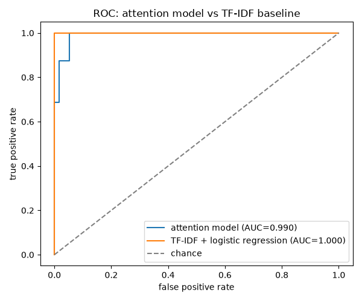
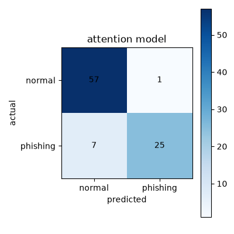

# PhishNet AI

Phishing email classification with a small attention-based neural network, benchmarked against a TF-IDF baseline.

## Problem

Phishing emails follow a handful of recognizable social-engineering patterns: urgency, a brand name, a suspicious link, a call to "verify" or "pay now." The interesting modeling question isn't just "can a model tell these apart" (lexically distinct phishing and normal text is an easy problem for almost any classifier) but "does a more expressive model with attention actually earn its complexity over a simple lexical baseline, and is its attention doing anything interpretable."

## Approach

Both a small attention-based neural network and a TF-IDF + logistic regression baseline are trained on the same train/val/test split and compared head to head on the same held-out test set, using precision, recall, F1, and ROC-AUC rather than accuracy, since the dataset is deliberately class-imbalanced (phishing is the minority class, as it is in practice).

## Data

The dataset is entirely synthetic (`src/phishnet/data.py`): 12 phishing templates (fake prizes, account-blocked threats, payment pressure, tax scares, tech-support scams, credential harvesting) and 12 normal templates (class schedules, invoices, meeting reminders, shipping updates), each filled in with randomized brand names, links, deadlines, names, and dates. The generator deduplicates at generation time, so every email string in the dataset is unique, which guarantees the train/val/test split has zero text overlap. See [`data/README.md`](data/README.md) for the full rationale. There is no real phishing corpus involved, and the numbers below should be read as a demonstration of the pipeline, not a benchmark on real-world mail.

## Method

Email text is lowercased, stripped of punctuation, and tokenized; the vocabulary is built only from the training split to avoid leakage into validation/test. The attention model:

- an embedding layer (16 dimensions)
- a multi-head self-attention layer (4 heads) over the token embeddings
- mean-pooling over the attended sequence, a linear layer, and a sigmoid

This is a feedforward network with a self-attention block for interpretability, not a full transformer encoder. It's trained with Adam and binary cross-entropy. The baseline is a standard TF-IDF vectorizer feeding a logistic regression classifier (scikit-learn), included specifically so the neural network's added complexity has something to be judged against.

## Results

Test-set metrics from `python -m phishnet train` (600 synthetic samples, 70/15/15 train/val/test split, seed 42):

| Model | Precision | Recall | F1 | ROC-AUC |
|---|---|---|---|---|
| Attention NN | 0.962 | 0.781 | 0.862 | 0.990 |
| TF-IDF + logistic regression | 1.000 | 1.000 | 1.000 | 1.000 |




The baseline actually wins here, and that's an honest result worth sitting with rather than hiding: the synthetic phishing and normal templates use almost entirely disjoint vocabulary, so a linear model over word frequencies has enough signal to separate them perfectly. The attention model's recall (0.781) is noticeably lower than its precision (0.962), meaning it's conservative, missing some phishing emails rather than raising false alarms. On real-world email, where phishing text is written to *mimic* legitimate language rather than use obviously distinct vocabulary, the gap between a bag-of-words baseline and a model that can weigh token relationships would very plausibly narrow or reverse; this synthetic dataset just isn't hard enough to show that.

**Is the attention meaningful?** A curated list of trigger words common in the phishing templates (`klik`, `verifikasi`, `segera`, `menang`, `bayar`, `blokir`, `bonus`, and similar) was checked against the attention each token position actually receives, averaged across a sample of phishing emails (`python -m phishnet train` writes this to `assets/metrics.json` under `attention_trigger_check`). The result: trigger tokens received essentially the same average attention (0.0865) as non-trigger tokens (0.0850), a roughly 2% difference. That's not a meaningful signal, it's noise. So the honest claim is: this attention mechanism does not clearly attend to the tokens a human would flag as suspicious, at least not in a way this simple check can detect. That lines up with a well-known finding in NLP interpretability research that attention weights don't reliably correspond to feature importance (Jain & Wallace, 2019); the heatmap below is a real artifact of the trained model, but should be read as "what the model attends to," not "why the model made this decision."


## Limitations

- Synthetic data with disjoint phishing/normal vocabulary makes this an easy separation problem; the baseline saturating at 1.0 F1 is a ceiling effect of the data, not evidence the linear model would generalize to real phishing text.
- The attention-meaningfulness check is a simple average-attention comparison on a curated word list, not a rigorous attribution method (e.g., integrated gradients or attention rollout); it's a sanity check, not proof of what the model is or isn't using.
- No real, labeled phishing corpus was used anywhere in this project.

## References

- Jain, S. and Wallace, B.C. "Attention is not Explanation." NAACL 2019.
- Vaswani, A. et al. "Attention Is All You Need." NeurIPS 2017 (for the multi-head attention mechanism used here).

## Getting started

```bash
git clone https://github.com/poggymacello/phishnet-ai.git
cd phishnet-ai
python3 -m venv .venv
source .venv/bin/activate  # on Windows: .venv\Scripts\activate
pip install -e ".[dev]"
python -m phishnet train      # trains both models, writes assets/metrics.json + figures
python -m phishnet eval       # re-runs the deterministic pipeline and prints metrics
pytest -q                     # run the test suite
ruff check .                  # lint
```

## Project structure

```
phishnet-ai/
├── src/phishnet/
│   ├── data.py          # synthetic dataset generator + vocabulary/tokenizer
│   ├── model.py          # attention classifier + training loop
│   ├── baseline.py       # TF-IDF + logistic regression baseline
│   ├── evaluate.py       # metrics, ROC/confusion-matrix plots, attention check
│   └── cli.py             # `phishnet train` / `phishnet eval`
├── tests/                 # pytest suite
├── assets/                # generated figures + metrics.json (committed)
├── data/README.md         # data provenance notes
├── .github/workflows/ci.yml
├── pyproject.toml
├── requirements.txt
├── Makefile
├── LICENSE
└── README.md
```

## License

MIT, see [LICENSE](LICENSE).
