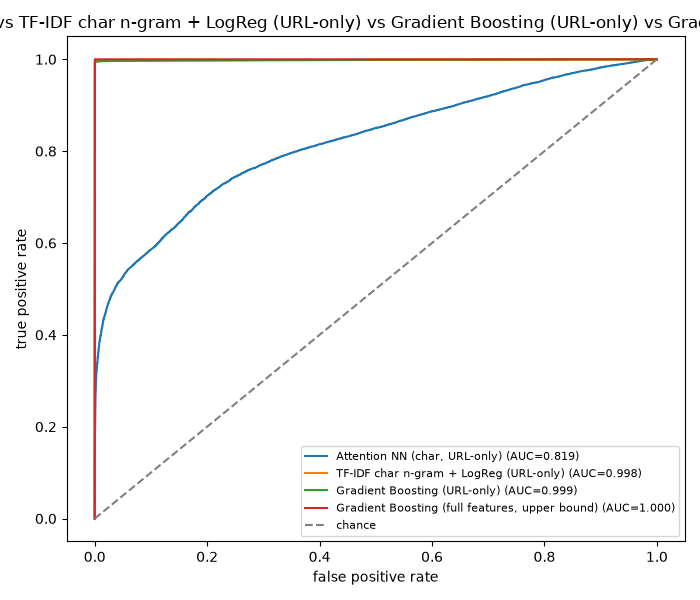

# PhishNet AI

[](https://github.com/poggymacello/phishnet-ai/actions/workflows/ci.yml)

Phishing URL detection: a character n-gram TF-IDF + logistic regression
model (deployed), gradient boosting on structured URL features, and a
small attention-based neural network, benchmarked head to head on the
real, public [PhiUSIIL](https://archive.ics.uci.edu/dataset/967/phiusiil+phishing+url+dataset)
dataset, with a domain-grouped split, a manual leakage audit, and a
FastAPI deployment. For a second real-data project with the same
methodology applied to network intrusion detection, see
[shadowtrace](https://github.com/poggymacello/shadowtrace).

## Problem

Phishing URLs are usually distinguishable from legitimate ones by some
combination of surface lexical patterns (brand-name substrings, suspicious
TLDs, obfuscation characters) and structural properties (subdomain count,
HTTPS usage, URL length). The interesting modeling questions are: how much
of that separability is genuine, deployable signal versus an artifact of
how the specific benchmark dataset was compiled; whether a model with
attention over URL characters earns its added complexity over much
simpler baselines; and what operating point (recall at a fixed, tolerable
false-positive rate) is actually achievable for a pre-click filter that
never gets to see the destination page.

## Data

[PhiUSIIL](data/README.md): 235,795 real URLs (134,850 legitimate,
100,945 phishing), 54 precomputed features. Full source, license,
citation, and the URL-only vs. page-content feature split are documented
in [`data/README.md`](data/README.md). In short: 21 features are
derivable from the URL string alone (what a real pre-click filter, and
this project's deployed model, can actually use); 28 more require
fetching the rendered page, and are reported only as an upper-bound
comparison, never deployed.

## Leakage controls

Every candidate feature was checked for single-feature AUC against the
label (`phishnet.leakage.single_feature_auc`) before trusting any model
result, following the rule that a raw audit number alone is not
sufficient -- every flag was manually inspected before deciding to drop
or keep it.

- **`URLSimilarityIndex` -- dropped.** Flagged at AUC 0.9961. Per-class
  distribution inspection (`df.groupby('label')['URLSimilarityIndex'].describe()`)
  showed it is *exactly* 100.0, zero variance, for every single legitimate
  row, and varies only for phishing rows. That's not a behavioral signal,
  it's the label encoded as a "similarity score." Dropped entirely.
- **Page-content features (`LineOfCode` 0.990, `NoOfExternalRef` 0.988,
  `NoOfImage` 0.984, ...) -- kept.** Per-class distributions show
  genuine, gradual, overlapping ranges (phishing pages tend to be minimal
  clones with far less code/content/imagery than legitimate production
  sites), not a circular encoding of the label. Kept, but never deployed,
  since they require fetching the page.
- **No URL-only feature crosses the 0.98 suspicious threshold** after
  dropping `URLSimilarityIndex` -- and yet the URL-only models still
  score 0.998-0.999 ROC-AUC (see Results), which directly triggers this
  project's own rule: *if any metric exceeds 0.98 after moving to real
  data, assume leakage until proven otherwise.* The follow-up
  investigation:
  - A shallow (max-depth-3) decision tree on the 21 URL-only features
    alone reaches 0.962 ROC-AUC using just three features in combination
    (`IsHTTPS`, `NoOfOtherSpecialCharsInURL`, `NoOfSubDomain`) -- the
    dataset's classes are unusually separable even by a small,
    interpretable rule set, not by one hidden leaky column.
  - Cross-tabulating `IsHTTPS` against the label explains most of it:
    **100% of PhiUSIIL's legitimate URLs use HTTPS** (0% use plain HTTP);
    phishing URLs split roughly 51%/49% HTTP/HTTPS. `IsHTTPS=0` is a
    near-perfect indicator of phishing *in this dataset*, but that's a
    property of how the legitimate class was sourced (evidently a
    curated list of established, all-HTTPS sites), not a property of
    phishing URLs in general -- a nontrivial fraction of legitimate,
    older, or self-hosted real-world sites still don't use HTTPS, and an
    increasing fraction of real phishing sites do, via free automated
    certificates. This is not circular leakage the way `URLSimilarityIndex`
    was (it's a real, checkable, univariate URL property, not a stand-in
    for the label), but it does mean the near-0.998 URL-only scores below
    should be read as "this specific benchmark is easier than deployment
    traffic," not as a general phishing-detection result. Documented
    further in Limitations and `docs/threat_model.md`.
- **Cross-split duplicate check.** `phishnet.leakage.duplicate_row_count_across_splits`
  confirms zero exact-feature-vector duplicates across train/val/test
  after the eTLD+1 group split (verified in `tests/test_real_pipeline.py`).

## Method

**Split.** Grouped by eTLD+1 (via `tldextract`), 70/15/15, so no domain's
URLs appear in more than one split -- a random row-level split would let
the model "recognize" a domain it already saw during training, which is
the single largest realistic leakage risk for URL-based phishing
detection in an always-new-domains deployment setting.

**Models**, all compared on the same held-out test set:

- **TF-IDF character n-gram + logistic regression** (`analyzer="char_wb"`,
  3-5 grams), URL-only, class-weight balanced. The one actually deployed.
- **Gradient boosting** (`HistGradientBoostingClassifier`) on the 21
  structured URL-only features.
- **Gradient boosting on the full 49-feature set** (URL-only + page
  content), trained on the full training set as an upper-bound reference,
  not a fair fourth competitor -- it needs page content this project
  never fetches in deployment.
- **Attention NN**: embedding (16-dim) + multi-head self-attention (4
  heads) + mean-pool + linear + sigmoid, over character-level URL
  encoding (max length 60). Trained on a stratified 20,000-row subsample
  of the training set (the three "deployable" models are all compared on
  this same subsample size for fairness); the O(seq_len²) memory cost of
  full-batch attention over the full ~160K-row training set was estimated
  at roughly 6.4GB for the attention-weight tensor alone, which isn't a
  practical default for a portfolio project. The full-feature GBM
  deliberately uses the complete training set instead, as a genuine
  "what does more data and more features buy you" ceiling.

**Metrics**: precision/recall/F1/ROC-AUC, recall at 1% and 5% FPR budgets
(`recall_at_fpr`), a bootstrap 95% CI on PR-AUC (`bootstrap_ci`), and an
automatic polarity sanity check (`polarity_warning`, flags ROC-AUC < 0.4
as a likely inverted label rather than a weak model) run on every model.

## Results

Test-set metrics from `python -m phishnet real-train` (full PhiUSIIL,
seed 42; base rates -- fraction phishing -- 41.0% train, 41.9% val, 50.5%
test, since group-splitting by domain doesn't guarantee identical class
balance per split the way row-level stratification would):

| Model | Precision | Recall | F1 | ROC-AUC | Recall@1%FPR | Recall@5%FPR | PR-AUC (95% CI) |
|---|---|---|---|---|---|---|---|
| Attention NN (char, URL-only) | 0.901 | 0.545 | 0.679 | 0.819 | 0.396 | 0.526 | 0.857 [0.854, 0.861] |
| TF-IDF char n-gram + LogReg (URL-only) | 1.000 | 0.992 | 0.996 | 0.998 | 0.996 | 0.997 | 0.999 [0.999, 0.999] |
| Gradient Boosting (URL-only) | 0.999 | 0.995 | 0.997 | 0.999 | 0.996 | 0.997 | 0.999 [0.999, 0.999] |
| Gradient Boosting (full features, upper bound) | 1.000 | 1.000 | 1.000 | 1.000 | 1.000 | 1.000 | 1.000 [1.000, 1.000] |



No model's ROC-AUC triggers the polarity sanity check (all comfortably
above 0.4).

**The attention NN is clearly the weakest model here**, the opposite of
what a more "expressive" model might be expected to do, and the honest
explanation is the training-subsample constraint above: it sees 20,000
rows where the two structured-feature and n-gram baselines see the full
~160,000-row training set (for GBM URL-only, same 20K subsample as the
NN; the gap to TF-IDF, also on 20K, suggests attention over raw
characters is a genuinely harder learning problem than either n-gram
counting or 21 hand-derived structured features on this scale of data,
not just a data-volume artifact).

**Is the attention meaningful?** The URL-character analog of the trigger-word
check (`url_attention_trigger_score`, comparing attention received by
"suspicious" characters -- digits, `@`, `%`, `-`, `_`, `=`, `&`, `?` --
against everything else) gives trigger-character attention of 0.0162 vs.
0.0182 for other characters -- other characters get *more* attention, not
less. Same conclusion as v1's synthetic-email check: no evidence this
attention mechanism attends to the characters a human security analyst
would flag as suspicious, consistent with the broader NLP-interpretability
finding that attention weights don't reliably indicate feature importance
(Jain & Wallace, 2019).

**Most interesting finding**: the near-perfect URL-only scores (0.998-0.999
ROC-AUC) are not the result of a single leaky column -- the audit is
clean -- but of the legitimate-URL class in this specific public dataset
being drawn from a source population that is 100% HTTPS, something no
real-world URL population is. A production deployment relying on this
model's current feature importances is relying, more than it should, on
a signal (`IsHTTPS`) that is actively eroding as free automated TLS
certificates make HTTPS phishing routine. See Leakage Controls above and
`docs/threat_model.md`'s evasion discussion.

## Synthetic vs. real

v1's fully synthetic email-text pipeline (`phishnet.data`, kept and still
tested) produced a TF-IDF baseline that hit a perfect 1.000 F1/ROC-AUC,
a ceiling effect of two template vocabularies that barely overlapped. The
real PhiUSIIL data does *not* saturate the same way for every model: the
URL-only TF-IDF and GBM models land at 0.998-0.999 (still very high, for
the dataset-artifact reasons above, but not a trivial 1.000), while the
attention NN is meaningfully weaker at 0.819. Real data didn't just lower
the numbers -- it changed which model wins and by how much, which the
synthetic dataset was never going to be able to show either way.

## Deployment

`POST /predict` accepts a raw URL string and returns a phishing score,
predicted label, and the top contributing character n-grams
(interpretability, via TF-IDF weight × logistic-regression coefficient
for that URL). Only the **TF-IDF character n-gram + logistic regression**
model is served -- not the GBM URL-only model, because its 21 structured
features (`TLDLegitimateProb`, `CharContinuationRate`, `URLCharProb`,
...) come from PhiUSIIL's own precomputed feature-extraction pipeline,
which isn't reproduced anywhere in this project; there is no code here
that turns an arbitrary raw URL into those exact values. The TF-IDF model
needs nothing but the URL string, so it's the one that can honestly be
called "deployable."

The submitted URL is **never fetched**. Scoring uses only the character
n-gram statistics of the string itself, deliberately, so this endpoint
can't be used to make the server issue requests to attacker-chosen hosts
(a live URL-fetching endpoint is a straightforward SSRF vector). See
`SECURITY.md` and `docs/threat_model.md`.

```bash
docker build -t phishnet:latest .
docker run --rm -p 8000:8000 phishnet:latest
curl -s localhost:8000/healthz
curl -s localhost:8000/model
curl -s -X POST localhost:8000/predict \
    -H "Content-Type: application/json" \
    -d '{"url": "http://secure-paypal-verify-account.tk/login.php"}'
```

Also exposes `GET /healthz`, `GET /model` (version, training data hash,
library versions), and `GET /metrics` (Prometheus format). Rate limited
(`PHISHNET_RATE_LIMIT`, default 120/minute), non-root container user,
`HEALTHCHECK` on the image, no raw URL ever written to logs (metadata
only: status code, latency).

Latency (`scripts/benchmark_latency.py`, 50 sequential requests against a
locally running container, single client thread): p50 5.4ms, p95 29.9ms,
p99 35.0ms, ~99 req/s throughput. The model itself is small (character
n-gram TF-IDF + logistic regression, ~200KB serialized); most of the
tail latency here is request/response overhead from the sequential
single-threaded benchmark client, not model inference -- a production
deployment behind a proper load generator with connection pooling would
be expected to show materially higher throughput.

## Limitations

- The near-0.998 URL-only ROC-AUC is inflated by this specific dataset's
  legitimate-class sourcing (100% HTTPS), not a general property of
  phishing URLs -- see Leakage Controls and `docs/threat_model.md`.
  Production performance on traffic outside this collection pipeline
  should be expected to be meaningfully lower.
- The attention-meaningfulness check is a simple average-attention
  comparison on a curated character set, not a rigorous attribution
  method (e.g., integrated gradients or attention rollout); it's a
  sanity check, not proof of what the model is or isn't using.
- The attention NN is trained on a 20,000-row subsample, not the full
  training set, for the memory-cost reasons in Method -- its reported
  metrics are not directly comparable to a hypothetical full-data version
  of the same architecture.
- The deployed model never sees page content, WHOIS/registration age,
  hosting infrastructure, or DNS reputation -- all real signals
  production phishing detectors use. It also never sees a URL's
  eventual redirect chain (shortened/redirected URLs are scored on the
  shortener string alone).
- False positives on newly registered, legitimate small-business domains
  are a real, not just hypothetical, risk: the eTLD+1 split specifically
  tests generalization to domains never seen in training, and new
  legitimate domains can resemble phishing domains' URL-level statistics
  (long, few established signals) more than an established brand does.

## References

- Prasad, A. and Chandra, S. "PhiUSIIL: A diverse security profile
  empowered phishing URL detection framework based on similarity index
  and incremental learning." Computers & Security, 2024.
- Jain, S. and Wallace, B.C. "Attention is not Explanation." NAACL 2019.
- Vaswani, A. et al. "Attention Is All You Need." NeurIPS 2017 (for the
  multi-head attention mechanism used here).

## What changed from v1

- **Real data replaces the synthetic generator as the primary pipeline.**
  `phishnet.data` (synthetic) is kept and still tested/CLI-accessible
  (`phishnet train`/`eval`) as a fast, dependency-free smoke test, but
  `phishnet.data_real` + `phishnet.real_pipeline` (`phishnet real-train`)
  is now what the README's Results and the deployed model are based on.
- **Group-by-domain (eTLD+1) split** replaces v1's ungrouped split --
  necessary because real URLs from the same domain can leak information
  a synthetic, deduplicated-at-generation dataset never had to worry
  about.
- **Two baselines, not one**: gradient boosting joins TF-IDF + logistic
  regression, plus a full-feature upper-bound variant.
- **Leakage audit added** (`phishnet.leakage`): single-feature AUC
  scoring, manual per-feature distribution inspection, and a
  cross-split duplicate check -- none of which existed or was needed
  against a synthetic, deduplicated-by-construction dataset.
- **Operating-point and uncertainty reporting**: recall at 1%/5% FPR
  budgets, bootstrap PR-AUC confidence intervals, and an automatic
  polarity sanity check, none of which the v1 report included.
- **Deployment**: a FastAPI service, Dockerfile (non-root, multi-stage,
  healthcheck), versioned joblib model artifact, latency benchmark
  script, and `docs/threat_model.md` (MITRE ATT&CK mapping, evasion
  discussion) -- v1 was evaluation-only, with no serving path at all.
- **The old "Roadmap: migrate to real data" section is gone** -- that
  migration is what this version is.

## Getting started

```bash
git clone https://github.com/poggymacello/phishnet-ai.git
cd phishnet-ai
python3 -m venv .venv
source .venv/bin/activate  # on Windows: .venv\Scripts\activate
pip install -e ".[dev]"

# fast synthetic pipeline (v1, no download needed)
python -m phishnet train
python -m phishnet eval

# real PhiUSIIL pipeline (v2)
python scripts/download_data.py       # ~57MB, checksum-verified
python -m phishnet real-train          # writes assets/metrics_real.json + roc_curve_real.png + models/phishnet-*.joblib

pytest -q                              # run the test suite
ruff check .                           # lint

# deployment
docker build -t phishnet:latest .
docker run --rm -p 8000:8000 phishnet:latest
python scripts/benchmark_latency.py --url http://127.0.0.1:8000
```

## Project structure

```
phishnet-ai/
├── src/phishnet/
│   ├── data.py             # v1: synthetic dataset generator + word-level vocabulary
│   ├── data_real.py         # v2: PhiUSIIL loader, eTLD+1 group split, char vocabulary
│   ├── leakage.py           # single-feature AUC audit + cross-split duplicate check
│   ├── real_pipeline.py     # v2 end-to-end: load, split, audit, fit, evaluate
│   ├── model.py              # attention classifier + training loop (shared v1/v2)
│   ├── baseline.py           # TF-IDF (word + char n-gram) + gradient boosting baselines
│   ├── evaluate.py           # metrics, ROC plots, operating-point + polarity checks
│   ├── artifact.py           # versioned deployment model artifact (joblib)
│   ├── api.py                 # FastAPI /predict service
│   └── cli.py                 # `phishnet train|eval|real-train`
├── tests/                     # pytest suite (v1 + v2 + API)
├── scripts/
│   ├── download_data.py      # checksum-verified PhiUSIIL download
│   └── benchmark_latency.py  # /predict latency benchmark
├── assets/                    # generated figures + metrics (committed)
├── data/
│   ├── README.md              # data provenance notes
│   └── sample/phiusiil_sample.csv  # small stratified fixture for tests/CI
├── models/                    # versioned joblib model artifact (committed)
├── docs/threat_model.md       # MITRE ATT&CK mapping + evasion discussion
├── Dockerfile
├── SECURITY.md
├── MODEL_CARD.md
├── .github/workflows/ci.yml
├── pyproject.toml
├── requirements.txt
├── Makefile
├── LICENSE
└── README.md
```

## License

MIT, see [LICENSE](LICENSE).
